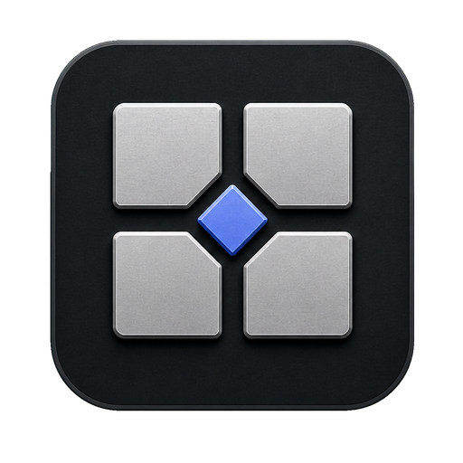

<p align="center">
  
</p>

<h1 align="center">Bureau</h1>

<p align="center">
  <strong>Local-first desktop mission control for software projects.</strong><br>
  Run, inspect, edit, preview, and version a project without assembling five separate dashboards.
</p>

<p align="center">
  <a href="https://github.com/as9284/bureau/actions/workflows/ci.yml"></a>
  <a href="https://github.com/as9284/bureau/releases"></a>
  
  
</p>

Bureau turns a folder of code into a live, observable workspace. Add a project and it identifies the
stack, tracks its processes, shows its ports and expected toolchains, embeds its local preview, provides a
native Files and Git workbench, and connects to Android tooling when the project needs it.

It is private by default: there is no account, telemetry service, or hosted backend. Project state stays
on the machine, while network access remains limited to features that inherently require it, such as Git
remotes, local web previews, and update checks.

## Download

Published Windows installers are available from [GitHub Releases](https://github.com/as9284/bureau/releases).
Choose `Bureau Setup <version>.exe`, run it, and select the installation directory normally. If the release
page is empty, a tagged build has not been published yet; use the development instructions below to run or
package Bureau from source. Installed releases check the same public channel for updates and only restart
to install one after the quit guard has dealt with running processes and unsaved files.

> [!NOTE]
> Bureau is currently distributed for Windows x64. The installer is not code-signed yet, so Windows
> SmartScreen may ask you to confirm that you want to run it.

### Optional tools

Bureau remains usable when an integration is unavailable. Install only the tools needed by your projects:

- [Git](https://git-scm.com/) for the Git workspace.
- [GitHub CLI](https://cli.github.com/) for publishing repositories to GitHub from Bureau.
- Android SDK platform tools and the emulator for Android device management.
- [scrcpy](https://github.com/Genymobile/scrcpy) for device mirroring and recording.
- Your usual Node.js, Python, Flutter, package-manager, and version-manager installations for running and
  switching project toolchains.

## What Bureau includes

| Workspace | Capabilities |
| --- | --- |
| **Overview** | Stack detection, project health, running-process summary, Git state, ports, and quick actions. |
| **Files** | Ignore-aware explorer, quick open, project search, CodeMirror editing, tabs, image preview, safe file operations, recovery drafts, and external-change conflict handling. |
| **Documents** | Sanitized Markdown reading with GFM, Mermaid, KaTeX, table of contents, reading progress, and HTML/PDF/print export. |
| **Processes** | Start, stop, restart, and configure project commands; stream logs; attach an interactive terminal; inspect CPU and memory; and stop full process trees. |
| **Preview** | Embedded loopback web preview, browser controls, responsive viewport presets, rotation, zoom, console state, external browser handoff, and DevTools. |
| **Android** | SDK and device discovery, AVD lifecycle, boot status, APK install/launch/uninstall, Logcat filtering/export, scrcpy, Flutter actions, and React Native Metro/device controls. |
| **Toolchains** | Detect expected and active Node.js, Python, and Flutter versions; resolve common version managers; and switch supported runtimes. |
| **Ports & tasks** | Inspect listeners and ownership, resolve port conflicts with confirmation, discover common project tasks, and run them through the same supervised process layer. |
| **Git** | Stage files or hunks, review broad text and binary diffs, commit, fetch/pull/push, manage branches, browse history, recover interrupted operations, and work with stashes, tags, worktrees, and submodules. |

The graphite interface supports dark and light themes, a command palette, keyboard navigation, resizable
workspaces, and an immersive mode that keeps project navigation out of the way until deliberately revealed.

## Quick start

1. Install and open Bureau.
2. Choose **Add project** and select a repository or project directory.
3. Review the detected stack and process definitions before running anything.
4. Use the project tabs for Files, Processes, Preview, Android, Toolchains, Ports, and Git.
5. Open the command palette with `Ctrl+K`; use `Ctrl+B` to toggle immersive navigation.

Projects may commit a `.bureau/config.json` file for shared process definitions. Bureau treats that file as
untrusted repository input: commands remain visible and are never blindly auto-run merely because a project
was opened.

## Security model

Bureau runs real operating-system processes and can render untrusted localhost applications, so the trust
boundary is deliberately narrow:

- The Electron renderer is sandboxed with context isolation, no Node.js integration, and a strict content
  security policy.
- Privileged work happens in the main process behind typed, validated IPC contracts. IPC requests are
  accepted only from the trusted application frame.
- The embedded preview has no preload bridge, uses an isolated session, allows loopback navigation only,
  and denies permissions, downloads, popups, and arbitrary external navigation.
- Process launches use resolved executables, argument arrays, and `shell: false`; destructive actions require
  explicit confirmation.
- Files operations are project-relative, while Markdown, Mermaid, remote images, and exports pass through
  dedicated sanitization and isolation paths.

The complete development-time security invariants live in [AGENTS.md](./AGENTS.md#3-ipc-security--invariants-non-negotiable).

## Development

### Prerequisites

- Windows 10 or 11
- Node.js 22
- npm
- Git

Native terminal support uses `node-pty`. On Windows, a source build may also require Visual Studio Build
Tools with the Desktop development with C++ workload.

```powershell
git clone https://github.com/as9284/bureau.git
cd bureau
npm ci
npm run dev
```

`npm run dev` starts the Vite-powered development workflow with renderer hot reload and main-process
restart support. `npm start` launches the standard Electron Forge development build.

### Verification

```powershell
npm run typecheck
npm run lint
npm run test:security
npm run test:unit
npm run test:integration
npm run test:component
npm run test:e2e
```

### Build an installer locally

```powershell
npm run make
```

The Windows installer is written to:

```text
out/make/nsis/x64/Bureau-Setup-<version>.exe
```

## Architecture

```text
src/main       Privileged Electron services: processes, files, Git, Android, preview, storage
src/preload    Frozen contextBridge surface
src/renderer   React 19 interface and Zustand workspace state
src/shared     Zod contracts, validation, IPC channels, error codes, and pure helpers
```

[DESIGN_SPEC.md](./docs/DESIGN_SPEC.md) defines the interface tokens and component language, while
[AGENTS.md](./AGENTS.md) documents the implementation boundaries and working agreement.

## Releases

Releases are automated with Git tags and GitHub Actions. The version in `package.json` must match the tag.
For a patch release:

```powershell
npm run release:patch
git push origin main --follow-tags
```

Use `release:minor` or `release:major` for the corresponding semantic-version bump. `npm version` updates
`package.json` and `package-lock.json`, creates the release commit and tag, and the tag triggers the Windows
release workflow. CI verifies the candidate, builds the NSIS installer and updater metadata, confirms that
the draft release's manifest and remote asset names agree, then publishes that same draft as the latest
GitHub Release.

## Project status

Bureau 1.0 is Windows-first and under active development. macOS and Linux makers exist in the build
configuration, but official release automation and packaged-update support currently target Windows x64.
Issues and focused pull requests are welcome. Please read [AGENTS.md](./AGENTS.md) and
[DESIGN_SPEC.md](./docs/DESIGN_SPEC.md) before changing architecture or interface behavior.

## License

MIT
